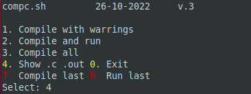
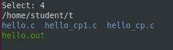
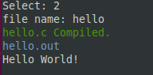
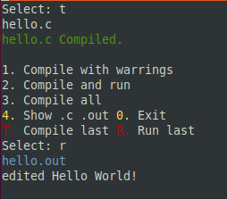
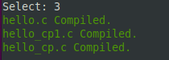

# gcc-compileAndRun
 gcc compile and run script to speed up testing .c programs

## Usage:
Make sure script has allow to execute, if not use `chmod +x compc.sh`  
The script works on the files that are in the directory with it.

### Program menu

### Show *.c and *.out files

### Compile and run
User don't have to write .c extension.  
Output file always will be the same name as input.

### Re-compile and run

### Compile all files
